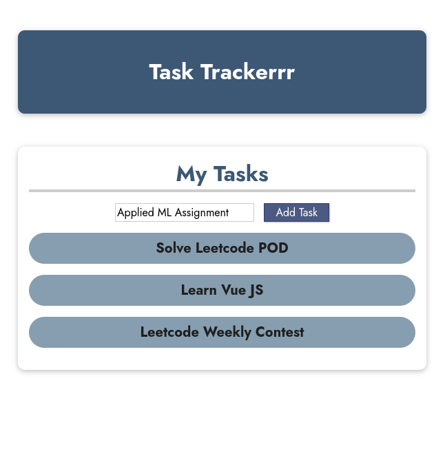

# Task-Tracker-VueJS
Basic Task Tracker built using Vuejs to learn Vue 3

## Features
- Can add tasks by either clicking on `Add Task` button or by pressing `ENTER` key.
- Once finished, tasks can be removed by clicking on them.

## Screenshot

### Task Trackerrr App

